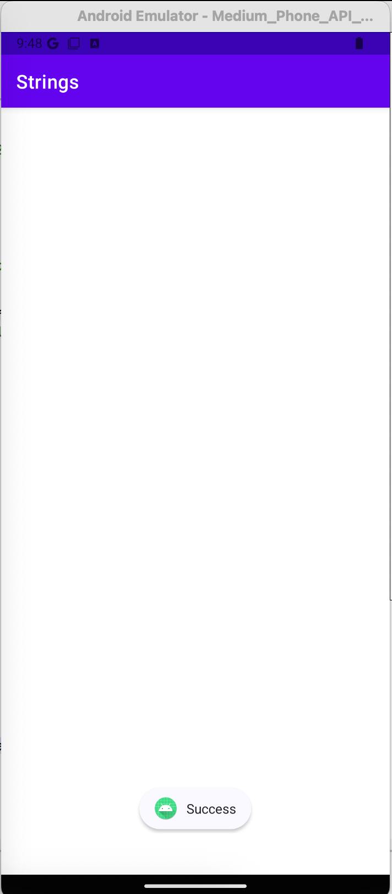

# Strings

## Challenge Description

Welcome to the Strings Challenge! In this lab,your goal is to find the flag. The flag's format should be "MHL{...}". The challenge will give you a clear idea of how intents and intent filters work on android also you will get a hands-on experience using Frida APIs.

## Solution

The MainActivity is empty. There is Activity2 which is exported and can be launched via the `mhl://` deeplink.
```xml
<activity
    android:name="com.mobilehackinglab.challenge.Activity2"
    android:exported="true">
    <intent-filter>
        <action android:name="android.intent.action.VIEW"/>
        <category android:name="android.intent.category.DEFAULT"/>
        <category android:name="android.intent.category.BROWSABLE"/>
        <data
            android:scheme="mhl"
            android:host="labs"/>
    </intent-filter>
</activity>
```

Here's the main code for the flag logic in Activity2.

```java
...
SharedPreferences sharedPreferences = getSharedPreferences("DAD4", 0);
String u_1 = sharedPreferences.getString("UUU0133", null);
boolean isActionView = Intrinsics.areEqual(getIntent().getAction(), "android.intent.action.VIEW");
boolean isU1Matching = Intrinsics.areEqual(u_1, cd());
if (isActionView && isU1Matching) {
    Uri uri = getIntent().getData();
    if (uri != null && Intrinsics.areEqual(uri.getScheme(), "mhl") && Intrinsics.areEqual(uri.getHost(), "labs")) {
        String base64Value = uri.getLastPathSegment();
        byte[] decodedValue = Base64.decode(base64Value, 0);
        if (decodedValue != null) {
            String ds = new String(decodedValue, Charsets.UTF_8);
            byte[] bytes = "your_secret_key_1234567890123456".getBytes(Charsets.UTF_8);
            Intrinsics.checkNotNullExpressionValue(bytes, "this as java.lang.String).getBytes(charset)");
            String str = decrypt("AES/CBC/PKCS5Padding", "bqGrDKdQ8zo26HflRsGvVA==", new SecretKeySpec(bytes, "AES"));
            if (str.equals(ds)) {
                System.loadLibrary("flag");
                String s = getflag();
                Toast.makeText(getApplicationContext(), s, 1).show();
                return;
            } else {
                finishAffinity();
                finish();
                System.exit(0);
                return;
            }
        }
```

1. The app expects the shared preferences file DAD4.xml to contain the string UUU0133, and its value is the current date.

```java
private final String cd() {
    SimpleDateFormat sdf = new SimpleDateFormat("dd/MM/yyyy", Locale.getDefault());
    String str = sdf.format(new Date());
    Intrinsics.checkNotNullExpressionValue(str, "format(...)");
    Activity2Kt.cu_d = str;
    String str2 = Activity2Kt.cu_d;
    if (str2 != null) {
        return str2;
    }
    Intrinsics.throwUninitializedPropertyAccessException("cu_d");
    return null;
}
```

2. It reads extra data sent to the intent, in the format `mhl://labs/<base64>`
3. The base64 value is derived from decrypting bqGrDKdQ8zo26HflRsGvVA== with the key your_secret_key_1234567890123456 and the IV 1234567890123456 [cyberchef recipe](https://gchq.github.io/CyberChef/#recipe=From_Base64('A-Za-z0-9%2B/%3D',true,false)AES_Decrypt(%7B'option':'UTF8','string':'your_secret_key_1234567890123456'%7D,%7B'option':'UTF8','string':'1234567890123456'%7D,'CBC','Raw','Raw',%7B'option':'Hex','string':''%7D,%7B'option':'Hex','string':''%7D)&input=YnFHckRLZFE4em8yNkhmbFJzR3ZWQT09)
4. If we satisfy the above requirements, the app will then make a JNI call to  `getFlag()`.

```java
public final class Activity2Kt {
    private static String cu_d = null;
    public static final String fixedIV = "1234567890123456";
}
```

First, I uploaded the following DAD4.xml to `/data/data/com.mobilehackinglab.challenge/shared_prefs`

```xml
<?xml version='1.0' encoding='utf-8' standalone='yes' ?>
<map>
    <string name="UUU0133">31/03/2026</string>
</map>
```

Then, send the intent with the expected URI.

```
adb shell am start -n com.mobilehackinglab.challenge/.Activity2 -a android.intent.action.VIEW -d  mhl://labs/bWhsX3NlY3JldF8xMzM3
```

But the toast message didn't give us the flag :(


I uploaded libflag.so to DogBolt, and without looking into the flag logic too much, it's doing a bunch of twists but not returning the final flag as a string. However, we can make a good guess that the flag should be stored somewhere during all the function calls in memory.

```
void Java_com_mobilehackinglab_challenge_Activity2_getflag(_JNIEnv *param_1)

{
  flag_fill();
  flag13();
  ZGS(0x2a);
  tyy(10,0x14);
  asds(5);
  zhs();
  x1(0x1e,0xf);
  ss(8);
  flag_fill();
  flag13();
  flag13();
  flag13();
  ZGS(0x2a);
  tyy(10,0x14);
  asds(5);
  zhs();
  dddff();
  tt();
  dd();
  x1(0x1e,0xf);
  ss(8);
  x1(0x1e,0xf);
  ss(8);
  dddff();
  zhs();
  _JNIEnv::NewStringUTF(param_1,"Success");
  return;
}
```

To solve, I dumped the app's memory and scanned for the flag.

```
uv run fridump.py -U Strings
```

```
dump % grep -iRn MHL{           
Binary file ./0x7c09f5b000_dump.data matches
dump % strings 0x7c09f5b000_dump.data | grep MHL{
MHL{IN_THE_MEMORY}
```